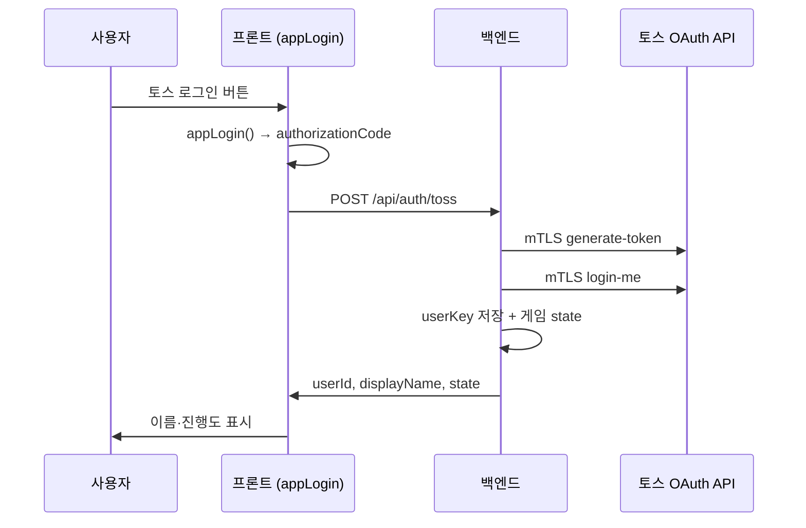

# 토스 로그인 개발 가이드

커피 키우기 미니앱에서 토스 회원을 식별하고 게임 데이터를 연결하는 방법입니다.

## 흐름



## 1. 앱인토스 콘솔 설정

1. [앱인토스 콘솔](https://apps-in-toss.toss.im/) → **grow-coffee** 앱 선택
2. **개발** → **토스 로그인** 추가
3. 약관·동의 항목 설정 (이름 필수 권장)
4. **mTLS 인증서** 발급 → `백엔드/cert/`에 저장
5. **복호화 키** 이메일 신청 → `DECRYPTION_KEY_BASE64`, `AAD_STRING` 설정

## 2. 백엔드 환경변수

`백엔드/.env` (`.env.example` 참고):

```env
TOSS_CLIENT_CERT_PATH=cert/public.crt
TOSS_CLIENT_KEY_PATH=cert/private.key
DECRYPTION_KEY_BASE64=...
AAD_STRING=...
```

로컬 실행:

```bash
cd 백엔드
npm install
npm run dev
```

헬스체크: `GET http://localhost:8787/api/health`  
→ `tossMtls: true`, `tossDecrypt: true` 확인

## 3. 프론트 연동 코드

| 파일 | 역할 |
|------|------|
| `프론트엔드/src/services/tossBridge.ts` | `appLogin()`, 세션 초기화 |
| `프론트엔드/src/services/api.ts` | `/api/auth/toss` 호출 |
| `프론트엔드/src/game/useCoffeeGame.ts` | 로그인 UI 상태·게임 state 반영 |
| `프론트엔드/src/components/SettingsSheet.tsx` | 토스 로그인 버튼 |

브라우저 테스트 (게스트):

```bash
cd 프론트엔드
npm run dev:vite
```

토스 샌드박스:

```bash
npm run dev
# intoss://grow-coffee
```

## 4. API

### POST `/api/auth/toss`

요청:

```json
{
  "authorizationCode": "...",
  "referrer": "DEFAULT",
  "deviceId": "...",
  "displayName": "커피 농부"
}
```

응답:

```json
{
  "ok": true,
  "userId": "toss_12345",
  "displayName": "홍길동",
  "source": "toss",
  "state": { "...": "..." },
  "balanceRules": { "...": "..." }
}
```

### 연결 끊기 (선택)

콘솔에서 callback URL 등록 후:

- `GET/POST /api/auth/toss/unlink?userKey=...`
- `TOSS_UNLINK_CALLBACK_AUTH` Basic Auth 설정 가능

## 5. 체크리스트

- [ ] 콘솔 토스 로그인 등록
- [ ] mTLS cert → `백엔드/cert/`
- [ ] 복호화 키 → `.env`
- [ ] 백엔드 `npm run dev`
- [ ] 샌드박스 앱에서 설정 → 토스 로그인
- [ ] UserBar에 토스 이름 표시 확인
- [ ] (선택) Supabase `schema.sql` 적용 후 Railway 배포

## 주의

- `authorizationCode`는 **10분·1회용** — 클라이언트에 장기 저장 금지
- AccessToken·RefreshToken은 **서버만** 보관
- 브라우저에서는 `appLogin()` 불가 → 게스트/mock 모드로 UI만 확인
